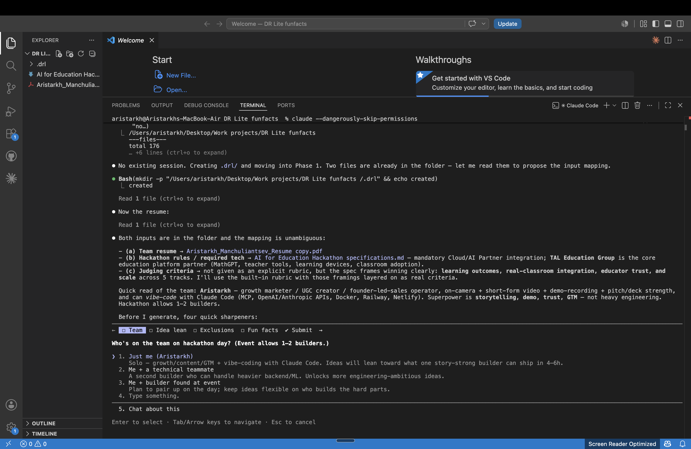
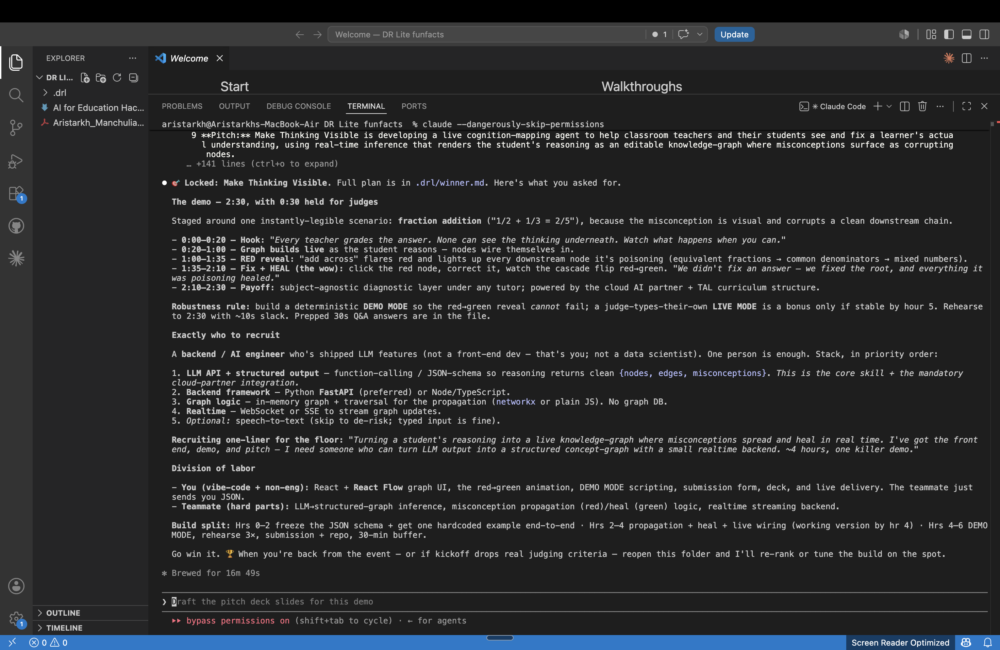

# dynamic-resonance-lite

Everyone can code now, the hard question is no longer **HOW** but **WHAT** to build. That's what wins a hackathon too: not the best code, but the right idea, a demo that lands, and a story judges believe.

I'm Aleh Manchuliantsau, a 7× founder — $10M+ raised, 10 patents, Techstars and SOSV alum. Planetarians (backed by AB InBev), SpyGlass AI (acquired 2025), 100%FOOD ($0→$5M in 18 months, zero outside funding), MOBYS ($0→$6M, 150 people), SOLAR-Si (spherical solar cells licensed to Roskosmos). My hardest lesson, learned twice: a moonshot with no credible route loses, and traction with no bigger picture loses, you need **both** at once.

That's Dynamic Resonance. One engine maxes out the model's wildest, highest-upside ideas, the second one scores them against coded math and historical data. After it hands you go-to-market routes, each with a wedge, a probability, and a cost. That's how I generate moonshots grounded in reality. 

**dynamic-resonance-lite** is the open-source, hackathon-sized version, which reads your team's skills, the sponsor tech, and the judging rubric, then loops with you to a locked winner, a second-by-second demo script, and an hour-by-hour build plan. 

  **Turn your team's resume and a hackathon's rules into scored, pitch-ready ideas in one command.**

  Hackathons aren't won by the best code. They're won by the right idea, a jaw-drop demo, and a story judges believe. `dynamic-resonance-lite` is a
  skill pack that does the hardest part for you: it reads your team's actual skills, the required sponsor tech, and the judging criteria, then
  generates candidate ideas, scores every one against a 100-point win-the-hackathon rubric, presents the top 3 as investor-style pitches, and loops
  with you until you lock the one you want to build — ending with a second-by-second demo script and an hour-by-hour build plan.

  It's a single `SKILL.md` file. No dependencies, no accounts, no code to run. Install it, drop your files in a folder, and type one command.

  ## Who this is for

  * **Hackathon builders** — solo or in a small team, who want a winning idea before the clock starts, not two hours in.
  * **Non-engineers who ship with AI** — you can vibe-code the front end, record the demo, and pitch; the skill tells you exactly what to build and
  who to recruit for the hard parts.
  * **Teams preparing upfront** — walk into the kickoff with a scored shortlist and a build plan already in hand.

  ## Quick start

  1. Install the pack (30 seconds — see below).
  2. Open your hackathon project folder.
  3. Drop in your inputs — team resume(s), the hackathon page/rules, and judging criteria (any format works).
  4. Run `/dynamic-resonance-lite`.
  5. Answer a few sharpening questions, then pick from your top 3 — or reroll for bolder ideas.

  ## Install

  Clone the pack into your agent's skills directory.

  **Claude Code:**

  ```
  git clone https://github.com/DynamicResonance/dynamic-resonance-lite ~/.claude/skills/dynamic-resonance-lite
  ```

  **Cursor or other agents:** clone the folder into that agent's respective skills directory. The pack uses only universal `SKILL.md` features (name +
  description frontmatter plus a Markdown body), so it works across any agent that supports skills.

  The skill self-updates via a fast-forward `git pull` in its own folder on each run, so a one-time clone is enough to stay current; you can still update manually with `git pull` in the skill folder.

  ## Usage

  1. Open your hackathon project folder.
  2. Drop your input files into it — team resume(s), the hackathon page/rules, and judging criteria. Any format works.
  3. Run `/dynamic-resonance-lite`.
  4. Point the skill at your files when asked.

  If no judging criteria are provided, the built-in rubric is used.

  ## See it work

  You point the skill at a folder that already holds your resume and the hackathon spec. It maps the inputs, then asks a few sharpening questions
  before it generates anything — team size, which way the ideas should lean, what you refuse to build, whether to use fun facts as creative fuel.

  

  From there it runs the full loop:

  ```
  You:   /dynamic-resonance-lite
  DRL:   [finds your resume + the hackathon spec in the folder, maps them]
         [asks 4 sharpeners: team size · idea lean · exclusions · fun facts]

  You:   Me + a technical teammate · Surprise me · No regulated industries · Fun facts ON
  DRL:   [writes an inputs digest — team skills, required sponsor tech, judging frame]
         [generates 12 candidates via 3 operators, scores them on the 100-pt rubric]
         Your top 3:
           1. Teach the Apprentice     — 92
           2. Socratic Silence         — 90
           3. Understanding, Verified  — 89

  You:   Solid, but a bit obvious. I want more WOW. Reroll.
  DRL:   [turns wildness up a level, bans the safe moves, pulls cross-domain mechanisms]
         Your top 3:
           1. Make Thinking Visible          — 90
           2. Learn From Your Feed           — 89
           3. The Textbook That Argues Back  — 89

  You:   Lock in "Make Thinking Visible." I build after I know the demo — keep it to 2:30.
  DRL:   [writes the winner plan]
  ```

  The winner file is the payoff: a staged, second-by-second demo (with a deterministic fallback so the reveal can't fail on stage), the exact teammate
  to recruit and the stack they must know, a clean division of labor, and an hour-by-hour build split.

  

  ## The pipeline

  `dynamic-resonance-lite` is a process, not a single prompt. Five phases run in order, each feeding the next:

  **Ingest → Generate → Score → Pitch → Decide**

  | Phase | What happens |
  | ----- | ----- |
  | **1. Ingestion** | Reads your team resume(s), the hackathon rules, and judging criteria. Builds an inputs digest of team skills, required sponsor
  tech, and scoring criteria — and asks a few sharpening questions to lock the brief. |
  | **2. Generation** | Produces 9–15 idea candidates by applying three operators — **asset removal**, **actor substitution**, and
  **constraint-into-product** — each escaping the obvious "default" idea for your team and event. |
  | **3. Scoring** | Ranks every candidate against a 100-point win-the-hackathon rubric — hard gates (buildable, demoable, sponsor-compliant, safe)
  plus weighted criteria tuned to the event's real judging frame. |
  | **4. Presentation** | Presents the top 3 as investor-style pitches — problem, solution, how it works, the demo-floor "wow" moment. |
  | **5. Feedback loop** | Takes your feedback — push one further, merge two, add info, or reroll bolder — then regenerates and re-scores until you
  settle on an idea. Lock one and it writes the full build-day plan. |

  ### The three operators

  Every idea comes from deliberately breaking the default. Instead of the obvious "AI tutor chatbot," each operator forces a different escape:

  * **Asset removal** — take away the thing everyone assumes the product must have (the screen, the answer) and see what becomes possible.
  * **Actor substitution** — swap who's doing what (the student becomes the teacher, the teacher becomes an agent).
  * **Constraint-into-product** — turn a hard limitation into the whole point of the product (the invisibility of a student's thinking *becomes* the
  thing you render and debug).

  Turn **fun-facts mode** on and the skill injects real-world facts as creative fuel — a why-now urgency, or a mechanism transplanted from an
  unrelated domain.

  ## Session state

  The skill writes all working state to a `.drl/` directory in the current project — the inputs digest, the generated ideas and scores for each
  iteration, your feedback history, and the final winner plan. Each hackathon project keeps its own isolated session, so you can stop and resume
  anytime.

  Add `.drl/` to your project's `.gitignore`.

  ```
  .drl/
  ├── inputs.md              # the digest: team, sponsor tech, judging frame
  ├── iteration-01/
  │   ├── candidates.md      # 9–15 generated ideas
  │   ├── scores.md          # rubric scores + rejections
  │   ├── top3.md            # the pitches you saw
  │   └── feedback.md        # your verbatim feedback for the next round
  ├── iteration-02/          # each reroll/iterate adds a folder
  └── winner.md              # the locked idea + demo script + build plan
  ```

  ## FAQ

  **I don't have judging criteria.** Fine — the built-in 100-point rubric is used, framed to the event. If the kickoff drops real criteria later,
  reopen the folder and the skill re-ranks in minutes.

  **I'm a solo / non-technical builder.** The skill designs around your actual strengths and, for each idea, spells out exactly what to build yourself
  and what to recruit a teammate for — including the specific stack that person should know.

  **Does it work outside Claude Code?** Yes. It uses only universal skill features, so it runs on any agent that supports `SKILL.md` skills — just
  clone it into that agent's skills directory.

  **Can I stop and come back?** Yes. Everything lives in `.drl/`, so each project resumes exactly where you left off.
